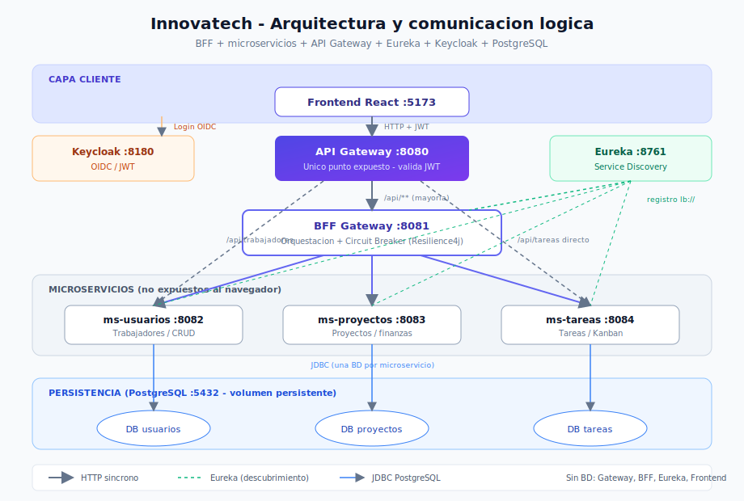
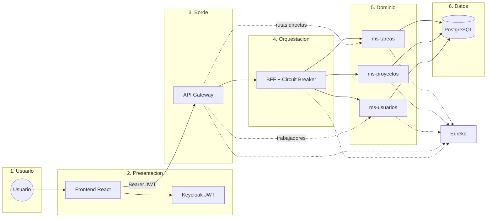
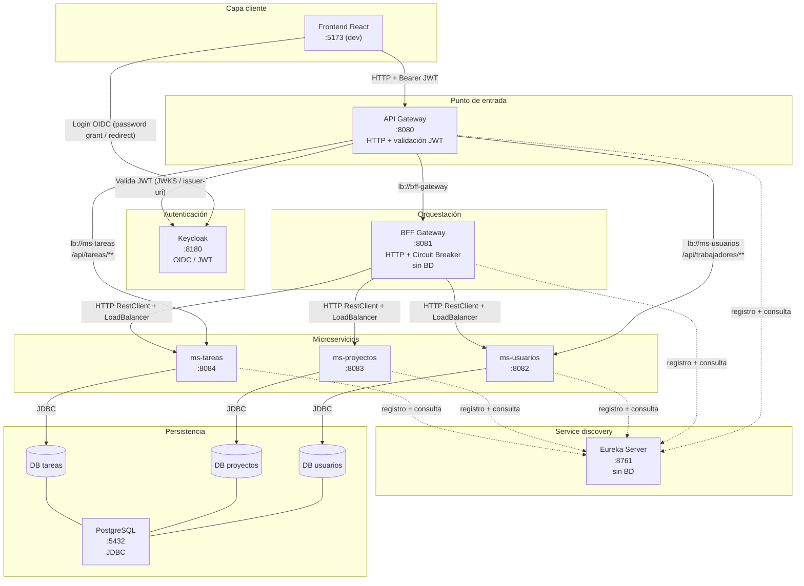
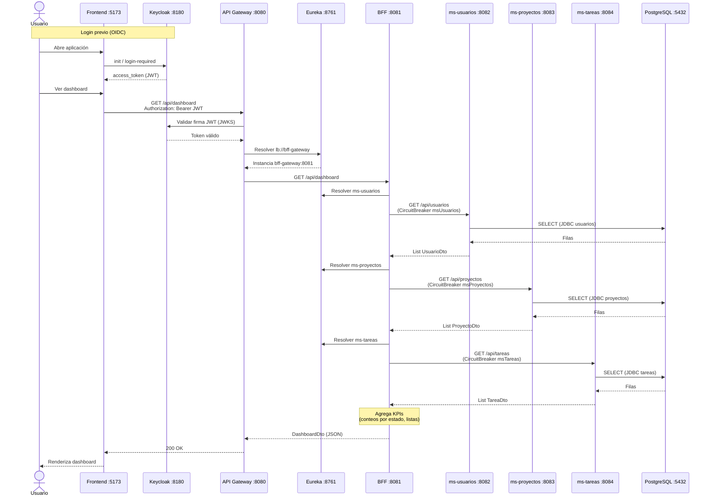

# Diagrama de comunicación – Innovatech

Documento de referencia sobre cómo se comunican los módulos del sistema Innovatech Solutions: frontend, autenticación, gateway, BFF, microservicios, service discovery y persistencia.

## Diagrama gráfico (SVG)

Abre en el navegador o en el preview del IDE:

Archivo: [`docs/assets/arquitectura-logica.svg`](assets/arquitectura-logica.svg)

## Vista lógica por capas

## Diagrama de arquitectura

## Puertos y protocolos

| Componente | Puerto (host) | Expuesto al host | Protocolo / tecnología | Notas |
|------------|---------------|------------------|------------------------|-------|
| Frontend React | 5173 | Sí (dev local) | HTTP | `VITE_API_URL`, `VITE_KEYCLOAK_*` en `.env` |
| API Gateway | 8080 | Sí | HTTP + JWT (OAuth2 Resource Server) | Único backend expuesto al navegador |
| BFF Gateway | 8081 | No (solo red Docker) | HTTP + Resilience4j Circuit Breaker | Orquesta llamadas a los MS |
| ms-usuarios | 8082 | No | HTTP + JDBC | BD dedicada `usuarios` |
| ms-proyectos | 8083 | No | HTTP + JDBC | BD dedicada `proyectos` |
| ms-tareas | 8084 | No | HTTP + JDBC | BD dedicada `tareas` |
| Eureka Server | 8761 | Sí | HTTP (REST Eureka) | Service discovery; no persiste datos de negocio |
| Keycloak | 8180 | Sí | HTTP (OIDC) | Emite y valida tokens JWT |
| PostgreSQL | 5432 | Sí | JDBC (`postgresql://`) | Tres bases en una instancia |

### Variables del frontend (`frontend-app/.env.example`)

| Variable | Valor por defecto | Uso |
|----------|-------------------|-----|
| `VITE_API_URL` | `http://localhost:8080` | Base URL del API Gateway |
| `VITE_KEYCLOAK_URL` | `http://localhost:8180` | Servidor Keycloak |
| `VITE_KEYCLOAK_REALM` | `innovatech` | Realm OIDC |
| `VITE_KEYCLOAK_CLIENT_ID` | `innovatech-frontend` | Cliente público del SPA |

## Flujo de login (autenticación)

1. El usuario abre el **Frontend** (`login-required` vía Keycloak JS).
2. Keycloak autentica al usuario en `:8180` (realm `innovatech`, client `innovatech-frontend`).
3. Keycloak devuelve un **access token JWT** al navegador.
4. El Frontend incluye `Authorization: Bearer <token>` en cada petición a `VITE_API_URL` (`:8080`).
5. El **API Gateway** valida el JWT contra Keycloak (`issuer-uri` / `jwk-set-uri` en perfil `docker`).
6. Si el token es válido, el Gateway enruta la petición según las reglas de ruta (BFF, ms-usuarios o ms-tareas).
7. El **BFF** y los **microservicios internos** no revalidan JWT; confían en la red interna y en que solo el Gateway está expuesto.

Rutas públicas en el Gateway (sin JWT): `/actuator/health`, `/actuator/info`, `/docs/**`.

## Flujo de datos (persistencia)

Cada microservicio tiene su propia base de datos PostgreSQL (patrón **database per service**):

| Microservicio | Base de datos | JDBC (Docker) |
|---------------|---------------|---------------|
| ms-usuarios | `usuarios` | `jdbc:postgresql://postgres:5432/usuarios` |
| ms-proyectos | `proyectos` | `jdbc:postgresql://postgres:5432/proyectos` |
| ms-tareas | `tareas` | `jdbc:postgresql://postgres:5432/tareas` |

El script `docker/postgres/init/01-databases.sql` crea las tres bases en el **primer arranque** del volumen `innovatech_postgres_data`. Credenciales compartidas: usuario `innovatech` (ver `.env.example`).

## Eureka: registro de servicios

| Servicio | `spring.application.name` | Se registra en Eureka |
|----------|---------------------------|------------------------|
| Eureka Server | `eureka-server` | **No** (`register-with-eureka: false`) |
| API Gateway | `api-gateway` | **Sí** |
| BFF Gateway | `bff-gateway` | **Sí** |
| ms-usuarios | `ms-usuarios` | **Sí** |
| ms-proyectos | `ms-proyectos` | **Sí** |
| ms-tareas | `ms-tareas` | **Sí** |
| Keycloak | — | No |
| Frontend | — | No |
| PostgreSQL | — | No |

El Gateway y el BFF resuelven destinos con `lb://<nombre-servicio>` (LoadBalancer + Eureka). En Docker, el perfil `docker` del Gateway también puede usar URLs directas (`http://bff-gateway:8081`, etc.).

## Rutas del API Gateway

Orden de evaluación (menor `order` = mayor prioridad):

| Orden | Ruta entrante | Destino | Filtro |
|-------|---------------|---------|--------|
| 0 | `/api/trabajadores/**` | `ms-usuarios` | Reescribe a `/api/usuarios/**` |
| 1 | `/api/tareas/**` | `ms-tareas` | Sin reescritura (acceso directo al MS) |
| 2 | `/api/**` | `bff-gateway` | Dashboard, proyectos, usuarios vía BFF, etc. |
| — | `/docs/bff/**` | `bff-gateway` | Swagger UI del BFF |
| — | `/docs/ms-usuarios/**` | `ms-usuarios` | Swagger UI MS usuarios |
| — | `/docs/ms-proyectos/**` | `ms-proyectos` | Swagger UI MS proyectos |

## Circuit Breaker en el BFF

El BFF usa **Resilience4j** (`@CircuitBreaker`) en `MicroserviceClient` con tres instancias:

| Instancia | Microservicio | Parámetros |
|-----------|---------------|------------|
| `msUsuarios` | ms-usuarios | ventana 10, umbral fallo 50 %, abierto 10 s |
| `msProyectos` | ms-proyectos | ventana 10, umbral fallo 50 %, abierto 10 s |
| `msTareas` | ms-tareas | ventana 10, umbral fallo 50 %, abierto 10 s |

Cada operación HTTP tiene **fallback**: listas vacías o `null`, de modo que el BFF puede degradar respuestas agregadas (p. ej. dashboard con ceros) si un MS no responde.

## Componentes sin base de datos

Estos módulos **no** usan PostgreSQL ni JPA:

- **API Gateway** — enrutamiento y seguridad JWT únicamente.
- **Eureka Server** — registro en memoria de instancias.
- **BFF Gateway** — agregación en memoria; no persiste entidades.
- **Frontend** — SPA estático; estado en el navegador.

Keycloak gestiona sus propios datos de identidad (internos al contenedor); no comparte las BD `usuarios` / `proyectos` / `tareas`.

---

## Diagrama de secuencia: `GET /api/dashboard`

Ejemplo de lectura agregada: el BFF consulta los tres microservicios y consolida KPIs.

Si algún microservicio falla de forma repetida, el Circuit Breaker correspondiente devuelve el fallback (lista vacía) y el dashboard se calcula con los datos disponibles.

---

Ver también: [Flujo de petición usuario → UI](DIAGRAMA_FLUJO_PETICION.md) · [Guía de inicio](GUIA_INICIO.md) · [README principal](../README.md)
