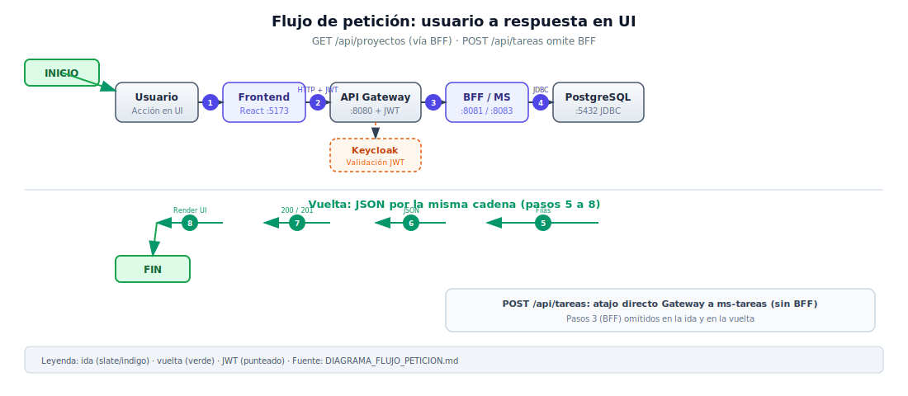
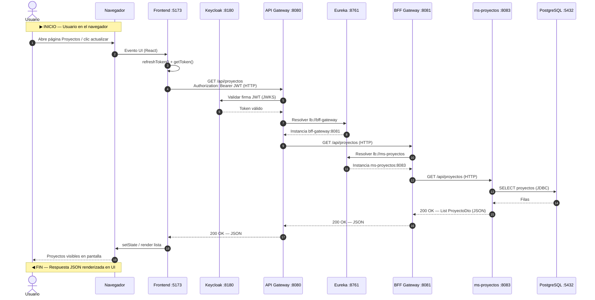
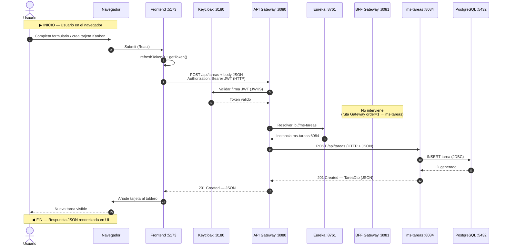

# Diagrama de flujo de petición – Innovatech

Este documento describe el recorrido completo de una petición HTTP desde que el **usuario interactúa en el navegador** hasta que la **respuesta JSON se renderiza en la interfaz**.

| Punto | Descripción |
|-------|-------------|
| **INICIO** | El usuario realiza una acción en la UI (clic, formulario, carga de página). El navegador ejecuta la SPA React, que obtiene el JWT de Keycloak y lanza `fetch` hacia el API Gateway (`VITE_API_URL`, puerto `:8080`). |
| **FIN** | El Frontend recibe el JSON (`200 OK` / `201 Created`), actualiza el estado de React y el navegador muestra los datos al usuario (lista, tarjeta Kanban, formulario confirmado, etc.). |

> **Nota de enrutamiento:** la mayoría de rutas `/api/**` pasan por el **BFF** (p. ej. proyectos, dashboard, usuarios). Las rutas `/api/tareas/**` van **directamente** del Gateway al microservicio `ms-tareas` (orden de ruta `1` en el Gateway), sin pasar por el BFF.

## Diagrama gráfico (SVG)

Flujo visual numerado (ida y vuelta):

Abrir en el navegador: [`docs/assets/flujo-peticion.svg`](assets/flujo-peticion.svg)

---

## Ejemplo 1: `GET /api/proyectos` (listar proyectos)

Flujo típico vía **BFF → ms-proyectos → PostgreSQL**.

---

## Ejemplo 2: `POST /api/tareas` (crear tarea)

El Gateway enruta `/api/tareas/**` **directamente** a `ms-tareas` (sin BFF). El Frontend envía el cuerpo JSON con título, estado, proyecto, etc.

---

## Resumen de participantes

| Participante | Rol en el flujo |
|--------------|-----------------|
| **Usuario** | Dispara la acción en la UI |
| **Navegador** | Ejecuta la SPA, DOM, red HTTP del cliente |
| **Frontend** | React + Keycloak JS; `authFetch` con Bearer JWT |
| **Keycloak** | Emite JWT (login previo) y firma validada por el Gateway |
| **API Gateway** | Punto de entrada `:8080`; valida JWT y enruta |
| **Eureka** | Service discovery (`lb://`); resuelve instancias |
| **BFF Gateway** | Orquestación HTTP hacia MS (proyectos, dashboard, etc.) |
| **MS** | Microservicio de dominio (`ms-proyectos`, `ms-tareas`, …) |
| **PostgreSQL** | Persistencia JDBC (una BD por microservicio) |

---

Ver también: [Diagrama de comunicación](DIAGRAMA_COMUNICACION.md) · [Guía de inicio](GUIA_INICIO.md) · [README principal](../README.md)
